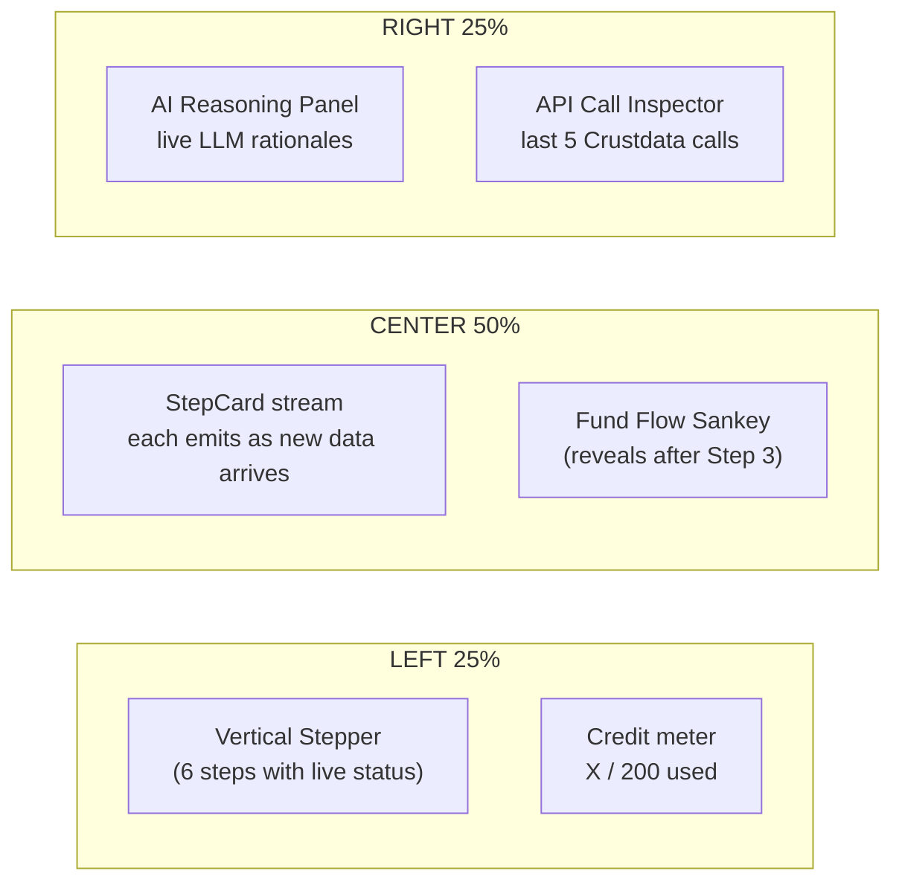

# MirrorVC — Hackathon Build Plan (v2)

## 0. Two big architecture insights from the Crustdata docs

**Insight 1 — `funding.investors` is a directly filterable Search field.** "What did a16z back in the last 60 days" is one structured API call, not web scraping:

```ts
{
  filters: { op: "and", conditions: [
    { field: "funding.investors",         type: "(.)", value: "Andreessen Horowitz" },
    { field: "funding.last_fundraise_date", type: ">",  value: "2026-02-19" }
  ]},
  sorts: [{ column: "funding.last_fundraise_date", order: "desc" }],
  fields: ["basic_info","funding","headcount","locations","taxonomy"],
  limit: 50
}
```

**Insight 2 — Crustdata's `web/search/live` + `web/enrich/live` let us read fund portfolio pages without a scraper.** Critical because:
- YC publishes its batch on [ycombinator.com/companies](https://www.ycombinator.com/companies) the day Demo Day starts — *before* most rounds are announced and before Crustdata's `funding.investors` index updates.
- a16z, Founders Fund, Khosla, and SPC publish portfolio pages that include companies that haven't filed a Form D and aren't in any structured DB yet.
- This is a fundamentally different signal than "who recently filed a funded round" — it captures **commitment**, not announcement.

So Step 1 becomes a **dual-source fund watcher** (Step 1a structured by investor, Step 1b portfolio-page-driven), all through Crustdata's own APIs — no third-party scraping, no Cheerio, no headless browsers. Both paths funnel into the same `Deal` schema and dedupe on `crustdata_company_id`.

## 1. Architecture (revised)

```mermaid
flowchart TB
  UI["Next.js UI<br/>App Router + shadcn + Framer"] -->|POST /api/run| Pipeline
  subgraph Pipeline["SSE Pipeline Orchestrator"]
    direction TB
    S1A["Step 1a: Fund Watcher (structured)<br/>company/search by funding.investors"]
    S1B["Step 1b: Fund Watcher (portfolio pages)<br/>web/search + web/enrich + company/identify"]
    Merge["Dedupe + merge on crustdata_company_id"]
    S2["Step 2: Thesis Extractor<br/>company/enrich + OpenAI"]
    S3["Step 3: Counterpart Finder<br/>autocomplete + company/search + LLM rerank"]
    S4["Step 4: Traction & Risk Scorer<br/>company/enrich hiring+web_traffic"]
    S5["Step 5: Founder Scorer<br/>company/enrich people + person/enrich"]
    S6["Step 6: Portfolio Builder<br/>power-law allocator"]
    S1A --> Merge
    S1B --> Merge
    Merge --> S2 --> S3 --> S4 --> S5 --> S6
  end
  Pipeline -->|crustdataClient| CD["Crustdata APIs<br/>9 endpoints, 15 rpm queue"]
  Pipeline -->|openaiClient| OAI["OpenAI<br/>GPT-4o / 4.1 structured outputs"]
  Pipeline -->|cache| FS["Disk cache + demo fixtures"]
  UI <-.SSE.- Pipeline
  UI -.opens.-> Dossier["Per-company Dossier<br/>(deep-dive on click)"]
```

Key design choices:
- **Deterministic pipeline, not free-form agent.** Six well-defined steps; OpenAI is invoked only where reasoning matters (HTML→companies extraction, thesis distillation, counterpart re-ranking, founder synthesis).
- **SSE everywhere.** A single `/api/run` route emits typed events; the UI renders them as they arrive so the demo *feels* live and judges can see the agent thinking.
- **Transparency-first UI.** Every score has a tooltip with the underlying signals and the AI's rationale string. Every Crustdata call is visible in an inspector panel. This sells the "AI-native VC" story far better than a black-box result.
- **Disk cache + demo fixture.** Cache every Crustdata response by request-body hash. Capture one good end-to-end run and ship `?demo=1` for the demo.

## 2. Tech stack & repo layout

- **Next.js 15** (App Router, TypeScript, Node runtime — Edge can't do disk cache).
- **Tailwind + shadcn/ui** + **Framer Motion** for step transitions and the Sankey reveal.
- **Vercel AI SDK (`ai` v5)** with **`@ai-sdk/openai`** for `generateObject` everywhere we need structured output.
- **Zod** for OpenAI outputs and Crustdata response parsing.
- **`p-queue`** for the 15 rpm cap.
- **`@visx/sankey`** (or a simple custom SVG) for the Fund Flow visualization.

```
contextcon-context-pookies-main/
  app/
    page.tsx                     // onboarding form
    run/page.tsx                 // live pipeline view
    portfolio/page.tsx           // final portfolio table + Sankey
    dossier/[id]/page.tsx        // per-company deep dive
    api/run/route.ts             // SSE pipeline orchestrator
    api/dossier/[id]/route.ts    // dossier data fetch
  lib/
    crustdata/
      client.ts                  // POST helper, queue, cache, credit meter
      schemas.ts                 // Zod for 9 endpoints
      queries.ts                 // byInvestor, byThesis, fundPortfolioPages, ...
    funds/
      registry.ts                // STATIC curated fund metadata (no runtime writes)
      extractors/
        yc.ts                    // optional custom HTML parser if generic LLM extract is brittle
        spc.ts
      types.ts                   // FundConfig, FreshnessPolicy, ExtractorHint types
    pipeline/
      step1a-structured.ts
      step1b-portfolioPages.ts
      step1-merge.ts
      step2-thesis.ts
      step3-counterparts.ts
      step4-traction.ts
      step5-founders.ts
      step6-portfolio.ts
      types.ts
      stream.ts                  // SSE event helpers
      events.ts                  // discriminated union of all step events
    openai/
      extractCompaniesFromHtml.ts
      thesis.ts
      counterpartRank.ts
      founderSynthesize.ts
    scoring/
      tractionSignals.ts         // pure functions
      riskFlags.ts
      founderRubric.ts
      valuationProxy.ts
      composite.ts               // final weighted score + status
      allocator.ts               // power-law capital allocator
    fixtures/
      demo-run.json
      topTechCompanies.ts        // FAANG + top startups list (for big-tech-alum signal)
      topUniversities.ts         // top-50 STEM (tiebreaker only)
      tier1Investors.ts          // Sequoia/Benchmark/etc. for pricing-pressure signal
      keywordIndustryMap.ts      // pre-curated keyword -> indexed industry mapping (cache hits, see Sec 4 Step 3)
  .cache/
    funds/                       // runtime-discovered: resolved investor names, last-known-good URLs
    company/                     // hashed Crustdata responses
    person/
    web/
  components/
    OnboardingForm.tsx
    PortfolioConstitutionCard.tsx
    StepCard.tsx
    ReasoningPanel.tsx           // shows the LLM rationale strings live
    ApiCallInspector.tsx         // shows the actual Crustdata requests/responses
    FundFlowSankey.tsx           // funds -> deals -> theses -> counterparts
    PortfolioTable.tsx
    Dossier.tsx
    SignalBadge.tsx              // confidence + source pill
    ValuationProxyDisclaimer.tsx
  .cache/
```

## 3. The Crustdata client (single most important file)

[lib/crustdata/client.ts](lib/crustdata/client.ts) must:
1. Set headers `Authorization: Bearer ${CRUSTDATA_API_KEY}` and `x-api-version: 2025-11-01`.
2. Funnel every request through a **shared `p-queue`** at `{ intervalCap: 15, interval: 60_000 }`.
3. **Hash the request body** (SHA-256) and cache the JSON response on disk under `.cache/{endpoint}/{hash}.json`. Cache hits skip the queue entirely.
4. Validate with Zod; on validation failure log the diff and return raw — don't crash the demo.
5. Maintain a per-run `creditMeter` (search 0.03/result, enrich 2/record, person enrich 1–7/record, web search 1/query, web fetch 1/page) and stream usage to the UI.
6. Expose typed wrappers: `companySearch`, `companyEnrich`, `companyAutocomplete`, `companyIdentify`, `personSearch`, `personEnrich`, `personAutocomplete`, `webSearch`, `webFetch`.

Watch for the documentation inconsistencies the explore agents flagged:
- `headcount.total` vs `headcount.latest_count` — accept both in Zod, normalize to `total`.
- Enrich response shape: top-level array vs `{ results: [...] }` — normalize to array.
- `locations.hq_country` (Search) vs `locations.country` (Autocomplete) — use the right one per endpoint.
- Person Enrich often returns `200` + empty `matches` instead of `404` — handle both.
- `funding.last_fundraise_date` returns a string ISO date; comparisons in filters use string `"YYYY-MM-DD"`.

## 4. Step-by-step pipeline detail

### 4.0 Fund registry (static config, no runtime writes to source)

[lib/funds/registry.ts](lib/funds/registry.ts) is a pure TypeScript constant. Source files never get rewritten at runtime; runtime discoveries (resolved investor strings, last-known-good portfolio URLs) live in `.cache/funds/{fundId}.json`.

```ts
// lib/funds/types.ts
export type FreshnessPolicy =
  | { kind: "cohort";  cohortLabelPattern: RegExp; currentCohortHint?: string } // YC, SPC
  | { kind: "rolling"; maxAgeDays: number; useCrustdataFundingDate: true };     // a16z, FF, Khosla

export type FundConfig = {
  id: "yc" | "a16z" | "spc" | "founders-fund" | "khosla";
  displayName: string;
  aliases: string[];                  // for autocomplete resolution
  portfolioCandidates: string[];      // ordered list of URLs to try in Step 1b
  discoveryQuery: string;             // fallback web/search/live query if all candidates fail
  freshnessPolicy: FreshnessPolicy;
  extractorHint: "generic-llm" | "yc-batch-cards" | "spc-fellowship";
};

// lib/funds/registry.ts
export const FUNDS: FundConfig[] = [
  {
    id: "yc",
    displayName: "Y Combinator",
    aliases: ["Y Combinator", "YC", "Y-Combinator"],
    portfolioCandidates: [
      "https://www.ycombinator.com/companies?batch=W26",
      "https://www.ycombinator.com/companies?batch=S25",
    ],
    discoveryQuery: "Y Combinator current batch companies",
    freshnessPolicy: { kind: "cohort", cohortLabelPattern: /^[WS]\d{2}$/, currentCohortHint: "W26" },
    extractorHint: "yc-batch-cards",
  },
  {
    id: "a16z",
    displayName: "Andreessen Horowitz",
    aliases: ["Andreessen Horowitz", "a16z", "Andreessen Horowitz LLC"],
    portfolioCandidates: ["https://a16z.com/portfolio/"],
    discoveryQuery: "a16z portfolio companies",
    freshnessPolicy: { kind: "rolling", maxAgeDays: 60, useCrustdataFundingDate: true },
    extractorHint: "generic-llm",
  },
  {
    id: "spc",
    displayName: "South Park Commons",
    aliases: ["South Park Commons", "SPC"],
    portfolioCandidates: [
      "https://www.southparkcommons.com/founder-fellowship",
      "https://www.southparkcommons.com/companies",
    ],
    discoveryQuery: "South Park Commons fellowship companies",
    freshnessPolicy: { kind: "cohort", cohortLabelPattern: /Fellowship\s\d{4}/i },
    extractorHint: "spc-fellowship",
  },
  // founders-fund, khosla: same shape as a16z
];
```

### 4.0a Hard caps & rate-limit budget (single source of truth)

Every step reads from this constant. Tuning the demo means changing one file, not hunting through pipeline code.

```ts
// lib/pipeline/limits.ts
export const LIMITS = {
  fundsToMirror:        4,   // max funds processed per run
  dealsPerFund:         3,   // max mirrored deals kept per fund after Step 1
  totalMirroredDeals:   8,   // global cap after merge (overrides above if exceeded)
  marketKeywordsPerThesis: 2, // hard cap, was 8 — reviewer P1 fix
  adjacentIndustriesPerThesis: 2,
  counterpartsSearchedPerDeal: 30,  // /company/search limit
  counterpartsKeptPerDeal: 4,       // after rerank+timing-match gate
  totalCounterparts:    25,         // global cap going into Steps 4–6
  foundersPerCompany:   3,          // enrich top 3 only
  webFetchPerRun:       6,          // sum across all steps
};
```

Implied rate-limit budget for a full run, dominated by Step 3 (the prior bottleneck):

| Step | Crustdata calls (worst case) | Notes |
|---|---|---|
| 1a (autocomplete fund names) | 4 | One per fund, cache-hit on repeat runs |
| 1a (search by investor)      | 4 | One per fund |
| 1b (web search confirm URL)  | ≤ 4 | Skipped if portfolioCandidates[0] succeeds |
| 1b (web fetch)               | ≤ 4 | One per fund |
| 1b (company identify)        | ≤ 4 | Batched, one call per fund covering up to 25 names |
| 1b (company enrich)          | ≤ 4 | Batched, one call per fund |
| 2 (company enrich)           | 1 | All 8 deals batched into one call |
| 2 (web search news, optional)| ≤ 8 | Only if enrich news empty/stale |
| 3 (industry autocomplete)    | ≤ 6 | See Step 3 below — capped via `keywordIndustryMap.ts` cache + 2 keywords per deal |
| 3 (counterpart search)       | 8 | One per mirrored deal |
| 4 (traction enrich)          | 1 | All 25 counterparts batched |
| 5 (founder person enrich)    | ≤ 4 | 75 founders batched at 25/call |
| **Total worst case**         | **~52** | Comfortably under 15 rpm × 4 min runtime |

### Step 1a — Fund Watcher (structured, by investor)

For each fund in `config.fundsToMirror` (capped to `LIMITS.fundsToMirror`):
1. **Resolve indexed investor names** — look up `.cache/funds/{fundId}.json` first. On miss, call `/company/search/autocomplete` on `funding.investors` for each alias, take suggestions whose lowercased value contains the alias, and **write the result to the cache file** (not back to source). Surface a one-time "Resolved investor names for {fund}" event to the UI.
2. Call `/company/search` with:
   - `funding.investors` `(.)` matched against any resolved name
   - `funding.last_fundraise_date > NOW - 60d`
   - `funding.last_round_type in [pre_seed, seed, series_a]` (configurable)
   - `locations.hq_country not_in <user blocked geos>`
   - `limit: LIMITS.dealsPerFund × 2` (over-fetch, then trim after sort)
3. Sort by `funding.last_fundraise_date desc`, keep top `LIMITS.dealsPerFund`. Tag `{ source: "structured", fund }` and stream `step1a.deal`.

### Step 1b — Fund Watcher (portfolio pages, the differentiator)

For each fund:
1. **Resolve current portfolio URL** — try `portfolioCandidates` in order via `/web/enrich/live`; the first one that returns >5KB of HTML wins and is written to `.cache/funds/{fundId}.json` as `lastKnownGoodUrl`. If all candidates fail, run `/web/search/live` with `discoveryQuery` + `site: <fund-domain>` and use the top result. **If still nothing, surface an explicit "Step 1b skipped for {fund}: portfolio page unreachable" event** — never silently fall back. Reviewer P1 fix.
2. Pass HTML to OpenAI `generateObject`. The prompt is parameterized by `extractorHint`:
   - `yc-batch-cards`: *"Extract only companies in batch matching `{currentCohortHint}`. Each card has name, one-liner, batch tag."*
   - `spc-fellowship`: *"Extract only the most recent fellowship cohort listed."*
   - `generic-llm`: extract everything; freshness is enforced downstream by Crustdata funding date (see step 4).
   ```ts
   z.object({
     cohortLabel: z.string().optional(),
     companies: z.array(z.object({
       name: z.string(),
       domain: z.string().optional(),
       oneLineDescription: z.string().optional(),
       batchOrYear: z.string().optional()
     }))
   })
   ```
3. Cap extracted list to **first 25** per fund before any Crustdata calls. Batch `/company/identify` with up to 25 `domains` (fallback to `names`) in a single call.
4. Batch `/company/enrich` for resolved IDs in a single call with `fields: ["basic_info","funding","headcount","locations","taxonomy"]`.
5. **Apply `freshnessPolicy`** before tagging:
   - `kind: "cohort"` — keep iff `batchOrYear` matches `cohortLabelPattern` AND (matches `currentCohortHint` if present, otherwise the most recent cohort label seen on the page).
   - `kind: "rolling"` — keep iff `funding.last_fundraise_date >= NOW - maxAgeDays` (Crustdata is the freshness oracle, not the page itself; this is the fix for the evergreen-page leak).
6. Tag survivors `{ source: "portfolio_page", fund, cohortLabel? }` and stream `step1b.deal`.

### Step 1 merge

Dedupe on `crustdata_company_id`. When a company appears in both, mark `source: "both"` (strong signal). Apply the **global** `LIMITS.totalMirroredDeals` cap by composite ranking: `both` > `portfolio_page` (cohort match) > `structured` > `portfolio_page` (rolling). Within ties, sort by `funding.last_fundraise_date desc`.

### Step 2 — Thesis Extractor

For each merged `Deal`:
1. `/company/enrich` with `fields: ["basic_info","news","taxonomy","competitors","funding"]`. Batch up to 25 domains per call.
2. If `news` is empty or stale, one `/web/search/live` with `sources:["news"]`, `query: "${company} ${stage} funding"`, `start_date: fundingDate - 30d` to `fundingDate + 14d`.
3. OpenAI `generateObject` — output is intentionally narrow to keep Step 3's filter resolution under the rate budget (reviewer P1 fix):
   ```ts
   z.object({
     thesisOneLiner: z.string(),
     beliefStatement: z.string(),         // "The belief that X will happen, creating a market for Y"
     marketKeywords: z.array(z.string()).length(LIMITS.marketKeywordsPerThesis), // exactly 2, normalized to short noun phrases
     adjacentIndustries: z.array(z.string()).length(LIMITS.adjacentIndustriesPerThesis),
     marketTiming: z.enum(["picks-and-shovels","early-application","platform-shift","vertical-incumbent-play"]),
     wedge: z.string(),                   // 1-line: where they enter the market
     whyNow: z.string(),                  // 1-line: what changed that makes this possible now
     redFlagsForCounterparts: z.array(z.string()).max(3) // e.g. "needs proprietary data"
   })
   ```
   Prompt instructs the model to pick the *most discriminating* 2 keywords, prefer short noun phrases that map to professional-network industries, and avoid synonyms.
4. Stream `step2.thesis` per company.

The `marketTiming` tag matters in Step 3 — you do **not** want to compare a "picks-and-shovels" infra play to a "vertical-incumbent-play" application. Filter accordingly.

### Step 3 — Counterpart Finder (the hardest step, rewritten to fit the rate budget)

There is **no "similar companies" endpoint** in Crustdata, so we synthesize one — but the v1 plan would have spent most of the rate budget on autocomplete resolution. The fix is a three-tier resolution strategy that hits the network only when necessary (reviewer P1 fix):

1. **Resolve `marketKeywords` → indexed industries** with bounded fan-out:
   - **Tier 1 — static map.** Look up each keyword in [lib/fixtures/keywordIndustryMap.ts](lib/fixtures/keywordIndustryMap.ts), a hand-curated 50-entry map covering the dominant categories funded by our 5 funds (e.g. `"AI observability" → "Software Development"`, `"defense tech" → "Defense and Space Manufacturing"`). Cache hit → 0 API calls.
   - **Tier 2 — runtime cache.** `.cache/funds/keyword-resolutions.json` accumulates resolutions across runs.
   - **Tier 3 — autocomplete.** Only on miss, call `/company/search/autocomplete` once per unresolved keyword, on **`taxonomy.professional_network_industry` only** (drop the second field — it was redundant). Write the result back to the runtime cache.
   - Hard ceiling: at most `LIMITS.totalMirroredDeals × LIMITS.marketKeywordsPerThesis = 16` lookups across an entire run, of which Tier 3 should be <6 in practice.
2. **Pool industries across deals before searching.** Before launching counterpart searches, dedupe the resolved industry set per deal (typically 1–3 unique values after dedup). This keeps Step 3 search calls at exactly `LIMITS.totalMirroredDeals` (≤8) — one per deal, not per keyword.
3. **Build the counterpart search** per mirrored deal:
   ```ts
   {
     filters: { op: "and", conditions: [
       { field: "taxonomy.professional_network_industry", type: "in",     value: <resolved industries (1-3)> },
       { field: "headcount.total",                         type: "<",      value: 30 },
       { field: "basic_info.year_founded",                 type: ">",      value: currentYear - 3 },
       { field: "funding.last_round_type",                 type: "in",     value: ["pre_seed","seed"] },
       { field: "locations.hq_country",                    type: "not_in", value: blockedGeos },
       { field: "crustdata_company_id",                    type: "!=",     value: mirroredDeal.id }
     ]},
     sorts: [{ column: "funding.last_fundraise_date", order: "desc" }],
     limit: LIMITS.counterpartsSearchedPerDeal  // 30
   }
   ```
4. **LLM re-rank** with the thesis `beliefStatement` + `marketTiming` + a compact `{name, oneLineDescription, industries, headcount, stage}` per candidate. **One OpenAI call per mirrored deal** with all 30 candidates in the prompt — not 30 separate calls. Schema:
   ```ts
   z.object({ rankings: z.array(z.object({
     id: z.number(),
     thesisAlignment: z.number().min(0).max(100),
     rationale: z.string().max(200),
     timingMatch: z.boolean(),
     redFlag: z.string().nullable()
   })) })
   ```
5. **Cheaper-valuation proxy** (deterministic, see [lib/scoring/valuationProxy.ts](lib/scoring/valuationProxy.ts)):
   - `+15` candidate stage strictly earlier than mirrored
   - `+10` candidate `last_round_amount_usd` < 0.5 × mirrored
   - `+10` HQ outside SF/NYC/London metros
   - `+10` no tier-1 investor in `funding.investors` (Sequoia/Benchmark/Accel/a16z/Founders Fund/Lightspeed/Kleiner/Greylock)
   - `+5`  `funding.last_round_type` is `pre_seed` or angel (still raising on conviction, not metrics)
   - `+5`  founded within last 18 months (not yet "priced into the market")
   Result is a 0–55 raw → normalized to 0–100 valuation-proxy score.
6. Keep top `LIMITS.counterpartsKeptPerDeal` per mirrored deal where `thesisAlignment >= 60` AND `timingMatch === true`. Apply global `LIMITS.totalCounterparts` cap by composite of thesisAlignment + valuationProxy.

Stream `step3.counterpart` per kept candidate, including the rationale string for the Reasoning Panel.

### Step 4 — Traction & Risk Scorer (NEW — fills a major gap in v1)

For each shortlisted counterpart, `/company/enrich` with `fields: ["headcount","hiring","web_traffic","funding","people"]` (one batched call across the cohort).

**Traction signals** (`lib/scoring/tractionSignals.ts`, all 0–100):
- **Headcount momentum** — read `roles.growth_6m` and `roles.growth_yoy` from search/enrich. Map to bucket: `>50% 6m → 100`, `20–50 → 75`, `0–20 → 50`, `negative → 20`.
- **Hiring velocity** — `hiring.openings_count` per current headcount + `hiring.openings_growth_percent`. Open roles >= 10% of headcount and growing → strong signal.
- **Web traffic momentum** — `web_traffic.domain_traffic.monthly_visitors` if present (snapshot only, not trend — flag as low-confidence).
- **Recent senior hire signal** — re-use the `/company/enrich` `people.decision_makers`; if any C-level joined in the last 6 months and didn't found the company, that's a "pre-growth-round" signal.

**Risk flags** (`lib/scoring/riskFlags.ts`, each adds a chip to the Dossier and reduces composite):
- **Over-funded for stage** — `funding.total_investment_usd > $5M` AND `funding.last_round_type in [pre_seed, seed]` AND `headcount.total < 15` (raised a lot, hasn't deployed → either hoarding cash or struggling to spend).
- **Founder churn** — any founder's current company in `/person/enrich` ≠ this company (cofounder left).
- **Stagnant headcount** — `roles.growth_yoy < 5%` for a sub-30-person company is bad.
- **No syndicate** — only one named investor → no peer-VC validation.
- **Round age** — `funding.last_fundraise_date > 18mo ago` → likely cap table is dry / down round risk.
- **Stage/headcount mismatch** — `headcount.total > 50` at "pre-seed" → either misclassified or burning fast.

Stream `step4.traction` per company with both the score and the chip list.

### Step 5 — Founder Scorer (substantially expanded from v1)

The rough plan's rubric was a starting point. The real VC questions are:

1. **Have they done it before, and how did it end?** — *prior exit* >> *prior failure* >> *no prior founding*. Crustdata person enrich → `experience.employment_details.past`; regex titles for `/founder|co-?founder|ceo/i` AND check the past company in `/company/identify` to learn whether it was acquired/IPO'd (look at `revenue.acquisition_status` field).
2. **Founder–market fit.** — Did they spend 5+ years in the customer's industry? Cross-reference `experience.employment_details.company_name` industries against the deal's industries.
3. **Top-of-class operator signal.** — Did they hold a senior IC or leadership role at a top tech company? `bigTechAlum` flag (boolean) AND `seniorityAtBigTech` (e.g. L6+ at Google, Staff at Stripe — heuristic via title regex).
4. **Repeat cofounder pair.** — Any past company shared between the two founders? Strong trust signal.
5. **Recency.** — Did they leave their last job <12mo ago? Use `recently_changed_jobs` or compute from `experience.employment_details.past[0].end_date`. Recent transition = full focus.
6. **Tenure depth.** — Average years per past role. <1yr each = job hopper red flag; 3yr+ = built things.
7. **Public builder presence.** — `social_handles.twitter_identifier` present + `professional_network.followers > 5000`. Soft signal but predictive of distribution.
8. **Solo-founder flag (risk).** — One founder pulled, others missing → mark.
9. **Education tiebreaker.** — Top STEM university only used to break ties when composite is within 3 points.

The function `lib/scoring/founderRubric.ts` computes signals **deterministically** first (cheap, debuggable), then OpenAI synthesizes a 0–100 composite + 3-bullet "Dossier highlights" + a "headline quote" for the UI.

```ts
// schema
z.object({
  composite: z.number().min(0).max(100),
  archetype: z.enum(["repeat-operator","domain-expert","technical-builder","first-time-founder","unknown"]),
  highlights: z.array(z.string()).length(3),
  dossierHeadline: z.string(),  // e.g. "2x founder, prior $200M exit, ex-Stripe ML"
  caveats: z.array(z.string()).max(2)  // e.g. "Solo founder", "Left Stripe 4 weeks ago"
})
```

Aggregate per-company by averaging across founders, then bonus +10 if at least one founder is `repeat-operator` archetype.

Stream `step5.founder` per founder card.

### Step 6 — Portfolio Builder (real VC math, not just sort + slice)

**Composite score per company:**

```
composite = 0.35 × thesisAlignment
          + 0.25 × founderScore
          + 0.20 × tractionScore
          + 0.15 × valuationProxy
          + 0.05 × dataConfidence       // % of signals available
          - 5 × riskFlagCount
```

**Status assignment:**
- `composite >= 75` → **Invest**
- `60–74` → **Watch** (revisit in 60 days)
- `< 60` → **Skip**

**Power-law-aware capital allocation** (this is what differentiates a real VC tool):

1. **Floor and ceiling discipline.** Per-cheque min = $5K (administrative-cost floor); max = `min(maxChequeSize, fundSize / sqrt(targetPortfolioSize))`. The `sqrt` cap enforces that no single bet exceeds the power-law-implied "max winnings" — you genuinely don't know which one will be the outlier.
2. **Two-tier allocation.** Allocate `0.6 × fundSize` proportional to composite score (the "conviction" tranche), then `0.4 × fundSize` *equally* across all Invest entries (the "spray" tranche). This reflects the real tension between conviction and the power law.
3. **Diversification constraints** (hard caps, computed before allocation finalization). Embeddings dropped for v1 (reviewer P2 fix) — the structured tags from Step 2 are sufficient:
   - **Thesis cap**: no more than 30% of capital in any single thesis cluster. **Cluster definition** (deterministic, no embedding API): two companies share a cluster iff they share their `marketTiming` tag AND `Jaccard(marketKeywords ∪ adjacentIndustries) >= 0.4`. Connected components of this graph are clusters. Cheap, debuggable, ships in 30 lines of code.
   - **Geography cap**: no more than 60% in a single country.
   - **Stage cap**: at least 40% pre-seed if the user opted into pre-seed.
4. **Portfolio sanity check.** If fewer Invest entries than `targetPortfolioSize`, automatically promote highest-scoring Watch entries until `count >= 0.7 × targetPortfolioSize`. If still short, surface a clear "Couldn't source enough conviction-grade companies under your constraints — consider relaxing X" warning to the user.
5. **Reserves.** Hold back `min(20%, maxChequeSize × 5)` as follow-on reserves for the next round (mark in UI but don't deploy in v1 — sets up the v2 follow-on logic).

Stream `step6.allocation` and the final `step6.portfolio` event.

## 5. Onboarding flow

[app/page.tsx](app/page.tsx) with `react-hook-form` + Zod. Fields per the rough plan plus:
- A **"What signals do you weight more?"** section with 4 sliders (thesis / founder / traction / valuation) — defaults to the weights above. Power users only; collapsed by default.
- The **portfolio constitution card** computed client-side:
  - Avg cheque, max cheque (with the `sqrt` discipline explained inline)
  - Viability check: `fundSize / targetPortfolioSize >= 5000`
  - Power-law warning: `targetPortfolioSize < 25` triggers *"VC returns concentrate in <5% of bets. With <25 companies you have a meaningful chance of hitting zero outliers. Recommended: 30+."*
  - Geo/sector block summary
- A **"Mirror these funds"** multiselect with logos and a one-line thesis per fund (a16z = "American dynamism + AI", YC = "earliest signal", SPC = "deep-tech hypothesis stage", etc.).

On submit, POST config to `/api/run` and navigate to `/run` which subscribes to the SSE stream.

## 6. UI / Demo Experience (the make-or-break section)

The demo must let a judge understand, in 90 seconds, *what* MirrorVC is doing, *why* each decision was made, and *that the data is real*.

### 6.1 The `/run` live view

Three-pane layout:



- **StepCard** (component used 6 times) — header with name, elapsed time, item count, credit cost. Body shows the *first 3 results* with a "show all" expander. Animates in on `step.start` event; rows pop in on `step.item` events with a 200ms stagger via Framer Motion.
- **Fund Flow Sankey** ([components/FundFlowSankey.tsx](components/FundFlowSankey.tsx)) — `Funds → Mirrored Deals → Theses → Counterparts → Final Portfolio`. Nodes thicken as data arrives. This single visual sells the "we're mirroring smart money" thesis instantly.
- **AI Reasoning Panel** — a vertical feed of every LLM rationale, tagged by company. *"DataLens AI: 94% alignment — 'Same belief in enterprise LLM observability, but DataLens enters via the SOC2 audit trail wedge instead of model output monitoring.'"* This is what makes judges believe the system is reasoning, not just filtering.
- **API Call Inspector** — collapsible cards: `POST /company/search` ⏱ `342ms` · `0.6 credits` · `12 results`. Click to expand: full request body and response. **This is the trust-builder** — judges immediately see real Crustdata calls flowing.
- **Credit meter** — a budget bar showing credits used vs estimated total (color-graded). Shows we respect the API.

### 6.2 The `/portfolio` view

After Step 6 completes, animate the transition. Show:

- **Portfolio table** ([components/PortfolioTable.tsx](components/PortfolioTable.tsx)) sorted by composite. Columns: Company · Mirrored from · Thesis · Stage · Valuation tier · Founder score · Traction · Composite · Cheque · Status. Each row has a status badge (Invest/Watch/Skip), and clicking the row opens the Dossier.
- **Allocation summary card**: total deployed, reserves held, count by status, diversification breakdown (donut by thesis cluster, donut by geo, donut by stage).
- **Constitution adherence ticks**: shows whether each onboarding constraint was respected, with green checks or amber warnings.
- **Final Sankey, fully resolved** with cheque sizes encoded as link width.

### 6.3 The Dossier (deep-dive per company)

[app/dossier/[id]/page.tsx](app/dossier/[id]/page.tsx) — opens as a slide-over panel from the table. Sections:

1. **Header** — name, logo, domain, HQ, stage, last round date+amount, investors, source badges (`Mirrored from a16z`, `Listed on YC W26`, `Both`).
2. **Mirror context** — *"This was sourced because [a16z] backed [Acme AI] on [date] with this thesis: [one-liner]. We searched for counterparts in [industry] at pre-seed/seed stage in [geos]."* — this is the killer "show your work" moment.
3. **Thesis match panel** — alignment score, rationale, timing-match check, the exact `beliefStatement` highlighted.
4. **Founder cards** — one per founder with the Dossier headline, archetype tag, 3 highlights, caveats, LinkedIn link, and a deterministic-signals expander.
5. **Traction signals** — 4 dials (headcount momentum, hiring velocity, web traffic, senior hires) with raw values + bucket badges.
6. **Risk flags** — chip list, each clickable to show the underlying data point.
7. **Composite & cheque rationale** — the full math: signal weights, raw scores, composite, status, cheque size, allocation reasoning.
8. **Provenance footer** — every field annotated with the Crustdata endpoint+timestamp it came from, with a `View raw response` link to the cached JSON. **This is the "AI-native VC" proof point** — every claim is auditable.

### 6.4 Signal confidence pattern

Every score in the UI carries a `<SignalBadge confidence="high|medium|low" />` derived from data completeness:
- High: all underlying signals available, fresh (<30 days).
- Medium: ≥60% of signals available.
- Low: <60% available — surfaced as a slight desaturation + tooltip *"Founder LinkedIn enrich missing — score based on company-page founders only."*

### 6.5 Demo mode (non-negotiable for hackathon)

- **`?demo=1`** replays `lib/fixtures/demo-run.json` with artificial 350ms delays per event, so judges see the full live-streaming UX even on bad WiFi. Capture this fixture from a real successful run during dev. Mark the run with a small "Replay" badge in the corner.
- **Per-step timeouts** (25s) — on timeout, fall through to fixture data for that step and show a small "cached" indicator. Better than a hung demo.
- **"Replay this run"** deep links — every successful live run is saved as a fixture; the URL `?run=<hash>` replays it.
- **Pre-flight** — on app start, run a single 1-result `/company/search` to verify the API key + show "Connected to Crustdata · 200 credits available" (or whatever) in the header. Catches dead keys before the demo.

## 7. VC reasoning rigor — what changed from v1

| Concern | v1 plan | v3 plan |
|---|---|---|
| Signal sources | Crustdata `funding.investors` only | Crustdata structured **+** fund portfolio pages via Crustdata web APIs |
| Stale-deal risk | Drop > 60d | Per-fund `freshnessPolicy`: cohort-tag match for YC/SPC, Crustdata funding-date oracle for rolling-portfolio funds (a16z/FF/Khosla) |
| Thesis depth | one-line + keywords | + market-timing tag, wedge, why-now, red-flags-for-counterparts |
| Counterpart filter | industry + headcount + stage + geo | + founded-year, + timing-match gate, + LLM rationale required |
| Step 3 rate-limit safety | unbounded autocomplete fan-out | static keyword→industry map + runtime cache + capped Tier-3 calls; total Step 3 budget ≤14 calls |
| Valuation proxy | 4 binary +1s | 6 weighted signals, normalized 0–100, includes investor-tier and stage-recency |
| Traction | absent | dedicated Step 4 with headcount/hiring/traffic/senior-hire signals |
| Risk flags | absent | 6 explicit risk flags reduce composite |
| Founder rubric | 6 signals, equal weight | 9 signals incl. exit vs failure, founder-market fit, recency, archetype tagging |
| Diversification clustering | OpenAI embeddings | structured-tag Jaccard on `marketKeywords ∪ adjacentIndustries` + `marketTiming` match — no second API |
| Portfolio construction | proportional allocation | power-law sqrt-cap + two-tier conviction/spray + thesis/geo/stage diversification caps |
| Reserves | none | 20% follow-on reserves (set up v2) |
| Transparency | implicit | every score auditable in Dossier with provenance |
| Fund config | runtime-written `crustdata/fundRegistry.ts` | static `lib/funds/registry.ts` + `.cache/funds/*.json` for runtime discoveries |
| Hard caps | implicit | single `lib/pipeline/limits.ts` constant gates every step |
| Degradation visibility | silent fallbacks | every skipped step / cache hit / dropped fund surfaces a UI event |

## 8. Out of scope for v1 (call out in README, not the demo)

- True valuation numbers — proxy tiers only, with a banner disclaimer.
- GitHub stars (Crustdata doesn't expose this) — could pull via Crustdata `web/enrich/live` of `github.com/<org>` HTML if time permits, but cut for v1.
- Time-series traction (only snapshots available).
- Follow-on / exit triggers (reserves earmarked, logic deferred to v2).
- Persistent multi-user accounts.

## 9. Build order (timeboxed for a 24–36h hackathon)

1. **Hours 0–2** — Repo scaffold, env, Crustdata client + Zod + queue + cache + credit meter. Author [lib/pipeline/limits.ts](lib/pipeline/limits.ts) and [lib/funds/registry.ts](lib/funds/registry.ts) (static, all 5 funds). Smoke-test 1a search.
2. **Hours 2–3** — Seed [lib/fixtures/keywordIndustryMap.ts](lib/fixtures/keywordIndustryMap.ts) with ~50 entries by hand-running `/company/search/autocomplete` for the most likely thesis keywords (AI observability, defense tech, dev tools, fintech infra, etc.). This eliminates Step 3's autocomplete dependency at runtime.
3. **Hours 3–4** — Onboarding form + portfolio constitution card.
4. **Hours 4–8** — SSE plumbing, Step 1a + Step 1b end-to-end with per-fund `freshnessPolicy` enforcement and explicit "skipped" UI events. Get the dual-source signal flowing.
5. **Hours 8–11** — Step 2 thesis extractor (keywords capped at 2), Reasoning Panel and API Call Inspector components.
6. **Hours 11–15** — Step 3 counterparts with the three-tier resolution strategy + LLM rerank + valuation proxy.
7. **Hours 15–18** — Step 4 traction + risk flags.
8. **Hours 18–22** — Step 5 founder scorer end-to-end with person enrich.
9. **Hours 22–25** — Step 6 portfolio builder with structured-tag clustering + power-law allocator.
10. **Hours 25–29** — `/portfolio` view, Sankey, Dossier slide-over, signal-confidence badges.
11. **Hours 29–33** — Capture demo fixture, build `?demo=1`, per-step fallbacks, pre-flight check.
11. **Hours 33–36** — Polish, valuation-proxy disclaimer banner, README, 90-second pitch script, record backup demo video.
