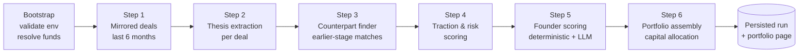

<div align="center">

# MirrorVC

### Mirror the world's best funds. Find their next deals first.

A transparent, AI-native venture sourcing pipeline that watches what
**Y Combinator**, **a16z**, **South Park Commons**, **Founders Fund**, and
**Khosla** are funding — then surfaces the earlier, cheaper-stage counterparts
operating against the *same* market thesis.

<br />

[](https://nextjs.org)
[](https://react.dev)
[](https://www.typescriptlang.org/)
[](https://tailwindcss.com)
[](https://crustdata.com)
[](https://openai.com)
[](https://vercel.com/new)

<br />

> **The pitch in one breath.**
> Pick a few funds you respect. We mirror their last 6 months of deals,
> distill each one into a tight market thesis, hunt for earlier-stage
> companies executing that same thesis, score founders + traction, and
> hand you a 10-line, capital-allocated portfolio you can defend in a Monday IC.
> Every Crustdata call, every LLM token, every ranking decision is streamed
> live and fully auditable.

</div>

---

## Table of Contents

- [Why this exists](#why-this-exists)
- [Live pipeline at a glance](#live-pipeline-at-a-glance)
- [The six-step pipeline](#the-six-step-pipeline)
- [Tech stack](#tech-stack)
- [Quick start (60 seconds)](#quick-start-60-seconds)
- [Configuration](#configuration)
- [Project layout](#project-layout)
- [Demo mode](#demo-mode)
- [Deploy to Vercel](#deploy-to-vercel)
- [Scripts](#scripts)
- [How it stays predictable](#how-it-stays-predictable)
- [Credits](#credits)

---

## Why this exists

LPs don't pay GPs to be late.
Mainstream sourcing tools either (a) dump 10,000 SaaS leads on you with no
thesis, or (b) hide their reasoning behind a black-box "AI score."

**MirrorVC takes the opposite stance:**

| Principle | What it means in the product |
|---|---|
| **Deterministic first** | Crustdata pulls, dedupe, scoring math, and capital allocation are pure functions. LLMs only synthesize where they obviously beat code. |
| **Transparent always** | Every API call, every prompt, every ranking change streams to a Live Feed in real time. Nothing happens off-screen. |
| **Mirror, don't guess** | We anchor on what *real* top funds wrote checks for in the last 6 months — then look adjacent. That's the entire moat. |
| **Ship the demo** | Strict per-run limits (max 8 mirrored deals, 25 counterparts, 6 web fetches) keep a full run under ~25s on a warm cache. |

---

## Live pipeline at a glance

```
┌──────────────┐   ┌────────────────────┐   ┌────────────────────┐   ┌────────────────┐
│   Onboard    │ → │  /api/run  (SSE)   │ → │   Live Feed UI     │ → │   Portfolio    │
│  (5 steps)   │   │  streams events    │   │  cards, warnings,  │   │   page +       │
│  fund picks, │   │  step.* / *.deal / │   │  Crustdata calls,  │   │   per-company  │
│  geo, sector │   │  thesis / score    │   │  reasoning trace   │   │   dossiers     │
└──────────────┘   └────────────────────┘   └────────────────────┘   └────────────────┘
```

Every event you see in the feed is the **exact same `PipelineEvent` union** the
backend emits — no parallel UI fiction.

---

## The six-step pipeline



| # | Step | What it actually does | Powered by |
|---|---|---|---|
| 0 | **Bootstrap** | Validates `CRUSTDATA_API_KEY` + `OPENAI_API_KEY`, resolves the picked funds against the registry. | — |
| 1 | **Mirrored deals** | For each selected fund, resolves investor aliases, then pulls every funded round in the **last 6 months** at the user's allowed stages via Crustdata `company/search`. Geo-blocking is applied client-side. Deduped by `crustdataCompanyId` and capped at 8. | Crustdata |
| 2 | **Thesis extraction** | Enriches each mirrored company, then asks the LLM to distill it into a structured thesis: market keywords, adjacent industries, why-now signals. | OpenAI |
| 3 | **Counterpart finder** | Uses each thesis to issue a fresh Crustdata `company/search` for **earlier-stage** companies in the same market. Reranked by an LLM and capped at 4 per deal, 25 total. | Crustdata + OpenAI |
| 4 | **Traction & risk** | Pulls headcount/funding signals, normalizes growth, applies hard risk flags (geo blocks, sector blocks, missing site). | Deterministic |
| 5 | **Founder scoring** | Resolves up to 3 founders per counterpart via Crustdata `person/search`, scores prior exits / repeat-founder signal, and asks the LLM to write a 1-line synthesis. | Crustdata + OpenAI |
| 6 | **Portfolio assembly** | Ranks the survivors, classifies into invest / watch / skip, and allocates capital under diversification constraints (cluster, geo, stage, max-cheque). | Deterministic |

All run-level caps live in [`lib/pipeline/limits.ts`](./lib/pipeline/limits.ts):

```ts
fundsToMirror: 4,         dealsPerFund: 3,         totalMirroredDeals: 8,
counterpartsSearchedPerDeal: 30,  counterpartsKeptPerDeal: 4,  totalCounterparts: 25,
foundersPerCompany: 3,    webFetchPerRun: 6,
```

---

## Tech stack

- **Framework** — Next.js 15 (App Router, Node runtime — disk caching is required)
- **Language** — TypeScript 6
- **UI** — Tailwind v4, Framer Motion, custom neo-brutalist "Crusty Crab" theme, `react-hook-form` + `zod`
- **Data** — Crustdata (`company/search`, `company/enrich`, `person/search`, `web/search/live`, `web/enrich/live`)
- **AI** — OpenAI via `@ai-sdk/openai` + Vercel AI SDK, structured `generateObject` with Zod schemas
- **Streaming** — Server-Sent Events from `/api/run`, decoded by a custom `usePipelineStream` hook
- **Concurrency** — `p-queue` + `p-limit` for Crustdata rate-limit safety (15 req / min window)
- **Cache** — JSON file cache under `.cache/` (or `/tmp/mirrorvc-cache` on serverless)

---

## Quick start (60 seconds)

```bash
# 1. clone + install
git clone https://github.com/Saksham-Gupta-off/contextcon-context-pookies-main.git
cd contextcon-context-pookies-main
npm install

# 2. add your keys
cp .env.example .env.local
# then edit .env.local and fill in CRUSTDATA_API_KEY and OPENAI_API_KEY

# 3. run it
npm run dev
# open http://localhost:3000
```

> **No Crustdata key?** Toggle **Demo mode** in the onboarding flow — the
> entire run replays from a real captured fixture in `lib/fixtures/demo-run.json`.

---

## Configuration

All configuration lives in environment variables. See [`.env.example`](./.env.example).

| Variable | Required | Default | Notes |
|---|---|---|---|
| `CRUSTDATA_API_KEY` | yes (live mode) | — | Used for every step except the LLM ones. |
| `OPENAI_API_KEY` | yes (live mode) | — | Required for thesis extraction (Step 2) onwards. |
| `MIRRORVC_LLM_MODEL` | no | `gpt-5.4-mini` | Set to `gpt-5.4` for ~3-5x slower, higher-quality runs. |
| `MIRRORVC_LLM_CONCURRENCY` | no | `8` | Max in-flight OpenAI calls per pipeline step. |
| `MIRRORVC_USE_TMP_CACHE` | no | `0` | Force `/tmp` cache (auto-on when `VERCEL=1`). |

The frontend lets the user pick **fund size**, **target portfolio size**, **max
cheque size**, **min/max stage**, **blocked geos**, and **blocked sectors** —
all of which are passed to `/api/run` and validated server-side via
[`lib/pipeline/config.ts`](./lib/pipeline/config.ts).

---

## Project layout

```
contextcon-context-pookies-main/
├─ app/
│  ├─ page.tsx                  # landing
│  ├─ onboarding/               # 5-step fund + constraints wizard
│  ├─ run/                      # live pipeline view (SSE consumer)
│  ├─ portfolio/                # final allocated portfolio
│  ├─ dossier/[id]/             # per-company deep dive
│  └─ api/
│     ├─ run/route.ts           # SSE pipeline orchestrator (maxDuration: 300)
│     └─ dossier/[id]/route.ts  # JSON read of persisted run
├─ components/
│  ├─ onboarding/OnboardingFlow.tsx
│  ├─ run/                      # LiveFeed, StepperRail, RightRail, usePipelineStream
│  ├─ portfolio/                # portfolio table + dossier widgets
│  ├─ krabs/                    # neo-brutalist primitives
│  └─ forms/, layout/
├─ lib/
│  ├─ cachePaths.ts             # local vs serverless cache root
│  ├─ crustdata/                # typed client + Zod schemas + interval queue
│  ├─ funds/                    # fund registry + per-fund cache
│  ├─ openai/                   # structured generateObject wrappers
│  ├─ pipeline/
│  │  ├─ config.ts              # runRequestSchema, RunConfig
│  │  ├─ limits.ts              # hard per-run caps
│  │  ├─ events.ts              # PipelineEvent union (single source of truth)
│  │  ├─ orchestrator.ts        # collector, context, persistRun
│  │  ├─ step1a-structured.ts   # mirrored deals (6mo)
│  │  ├─ step2-thesisExtractor.ts
│  │  ├─ step3-counterpartFinder.ts
│  │  ├─ step4-tractionScorer.ts
│  │  ├─ step5-founderScorer.ts
│  │  ├─ step6-portfolioBuilder.ts
│  │  ├─ runStore.ts            # load persisted runs + fixture fallback
│  │  ├─ stream.ts              # SSE encoding helpers
│  │  └─ demoReplay.ts          # offline fixture replay
│  ├─ scoring/                  # pure scoring helpers
│  └─ fixtures/demo-run.json    # captured real run for demo mode
├─ scripts/
│  ├─ generate-demo-fixture.ts  # regenerate the demo fixture from a live run
│  └─ smoke-step1a.ts           # standalone smoke test for Step 1
├─ vercel.json                  # function maxDuration overrides
└─ AGENTS.md                    # implementation guide / source of truth
```

---

## Demo mode

Don't have API keys yet? Just want a pixel-perfect screen-record?

1. On the onboarding screen, flip the **Demo mode** toggle.
2. Pick any funds and constraints you like (UI only — they're ignored in demo).
3. Hit **Run pipeline**.

The `/api/run` route detects `demo: true` and replays
[`lib/fixtures/demo-run.json`](./lib/fixtures/demo-run.json) through the same
`PipelineEvent` stream the live pipeline uses — same UI, same timing feel,
zero external calls, zero credits spent.

To refresh the fixture from a real run:

```bash
npx tsx scripts/generate-demo-fixture.ts
```

---

## Deploy to Vercel

The repo is **Vercel-ready** out of the box.

```bash
# one-shot
npx vercel        # link + deploy a preview
npx vercel --prod # promote to production
```

Then set environment variables in the Vercel dashboard
(*Project → Settings → Environment Variables*):

- `CRUSTDATA_API_KEY`
- `OPENAI_API_KEY`
- (optional) `MIRRORVC_LLM_MODEL`, `MIRRORVC_LLM_CONCURRENCY`

What we already configured for you:

- [`vercel.json`](./vercel.json) sets `maxDuration: 300` on `/api/run` so the
  streaming pipeline isn't killed by the default 10s timeout.
- [`lib/cachePaths.ts`](./lib/cachePaths.ts) auto-redirects all disk writes
  to `/tmp/mirrorvc-cache` when `VERCEL` is in the environment, since
  Vercel's serverless filesystem is read-only outside `/tmp`.

> **Hobby plan note.** `maxDuration: 300` only takes effect on Pro. On Hobby
> the platform caps at 60s, which is still enough for a full live run with
> a warm Crustdata cache.

---

## Scripts

| Command | What it does |
|---|---|
| `npm run dev` | Next.js dev server on `localhost:3000` |
| `npm run build` | Production build |
| `npm run start` | Run the production build |
| `npm run lint` | ESLint |
| `npm run typecheck` | `tsc --noEmit` |
| `npm run smoke:step1a` | Standalone smoke test for the mirrored-deals step (live Crustdata) |

---

## How it stays predictable

A hackathon-grade pipeline that calls 5+ external endpoints across 6 steps
can easily explode in latency, cost, or rate-limit errors. We keep it tight
with three rules:

1. **Hard caps everywhere.** Every loop is bounded by [`limits.ts`](./lib/pipeline/limits.ts) — no
   "we'll just look at all of them" fan-outs.
2. **Cache by request hash.** Every Crustdata call is content-hashed and
   cached to disk; reruns of the same onboarding payload are nearly
   instant.
3. **Fail loudly in the UI.** Any `step.warning`, `run.blocked`, or
   `run.failed` event renders as a red card in the Live Feed — no silent
   swallowing.

---

## Credits

Built by **Team ContextCon** for the Context Con hackathon.

- Data backbone — [Crustdata](https://crustdata.com)
- Reasoning — [OpenAI](https://openai.com) via [Vercel AI SDK](https://sdk.vercel.ai)
- UI inspiration — neo-brutalist "Crusty Crab" theme

<div align="center">

<sub>If MirrorVC helps you find one founder you would have missed, that's the
whole point. Star the repo and tell us.</sub>

</div>
