<!-- ═══════════════════════════════════════════════════════════════════ -->
<!--                          M I R R O R   V C                          -->
<!--                    ~  neo-brutalist README v2  ~                    -->
<!-- ═══════════════════════════════════════════════════════════════════ -->

<div align="center">

<a href="#"></a>

<!-- pattern-bar (mirrors the UI's 4-stripe `.pattern-bar`) -->
<p>
  
</p>

### A transparent, AI-native venture sourcing pipeline.

We watch what **Y Combinator**, **a16z**, **South Park Commons**, **Founders Fund**,<br/>
and **Khosla** are funding — then surface the earlier, cheaper-stage counterparts<br/>
operating against the *same* market thesis.

<br/>

<p>
  <a href="https://nextjs.org"></a>
  <a href="https://react.dev"></a>
  <a href="https://www.typescriptlang.org/"></a>
  <a href="https://tailwindcss.com"></a>
  <a href="https://crustdata.com"></a>
  <a href="https://openai.com"></a>
  <a href="https://vercel.com/new"></a>
</p>

<br/>

<!-- Eugene K. speech bubble — styled like the hero card on /landing -->
<table align="center" width="720">
<tr>
<td align="left" style="padding:16px 22px;">

<sub>`EUGENE K. · AI GP`</sub>

> **"Arrr — I don't invest in the first mover.<br/>
> I invest in the cheaper one right behind 'em."**

<sub>— the pitch in one breath, according to the crab himself.</sub>

</td>
</tr>
</table>

<br/>

Pick a few funds you respect. We mirror their last 6 months of deals, distill each one into a<br/>
tight market thesis, hunt for earlier-stage companies executing that same thesis, score founders<br/>
\+ traction, and hand you a 10-line, capital-allocated portfolio you can defend in a Monday IC.<br/>
Every Crustdata call, every LLM token, every ranking decision is streamed live and fully auditable.

</div>

<!-- pattern-bar divider -->
<p align="center">
  
</p>

## Table of Contents

<table>
<tr>
<td width="50%" valign="top">

- [Why this exists](#why-this-exists)
- [Live pipeline at a glance](#live-pipeline-at-a-glance)
- [The six-step pipeline](#the-six-step-pipeline)
- [Tech stack](#tech-stack)
- [Quick start (60 seconds)](#quick-start-60-seconds)

</td>
<td width="50%" valign="top">

- [Configuration](#configuration)
- [Project layout](#project-layout)
- [Demo mode](#demo-mode)
- [Deploy to Vercel](#deploy-to-vercel)
- [Scripts](#scripts)
- [How it stays predictable](#how-it-stays-predictable)

</td>
</tr>
</table>

---

## Why this exists

> **LPs don't pay GPs to be late.**
> Mainstream sourcing tools either (a) dump 10,000 SaaS leads on you with no
> thesis, or (b) hide their reasoning behind a black-box "AI score."

**MirrorVC takes the opposite stance.** Four principles, no mysticism:

<table>
<tr>
<th align="left">Principle</th>
<th align="left">What it means in the product</th>
</tr>
<tr>
<td valign="top"></td>
<td valign="top">Crustdata pulls, dedupe, scoring math, and capital allocation are <b>pure functions</b>. LLMs only synthesize where they obviously beat code.</td>
</tr>
<tr>
<td valign="top"></td>
<td valign="top">Every API call, every prompt, every ranking change streams to a Live Feed in real time. Nothing happens off-screen.</td>
</tr>
<tr>
<td valign="top"></td>
<td valign="top">We anchor on what <i>real</i> top funds wrote checks for in the last 6 months — then look adjacent. That's the entire moat.</td>
</tr>
<tr>
<td valign="top"></td>
<td valign="top">Strict per-run limits (max 8 mirrored deals, 25 counterparts, 6 web fetches) keep a full run under ~25s on a warm cache.</td>
</tr>
</table>

---

## Live pipeline at a glance

```
┌──────────────┐   ┌────────────────────┐   ┌────────────────────┐   ┌────────────────┐
│   Onboard    │ → │  /api/run  (SSE)   │ → │   Live Feed UI     │ → │   Portfolio    │
│  (5 steps)   │   │  streams events    │   │  cards, warnings,  │   │   page +       │
│  fund picks, │   │  step.* / *.deal / │   │  Crustdata calls,  │   │   per-company  │
│  geo, sector │   │  thesis / score    │   │  reasoning trace   │   │   dossiers     │
└──────────────┘   └────────────────────┘   └────────────────────┘   └────────────────┘
```

> Every event you see in the feed is the **exact same `PipelineEvent` union** the
> backend emits — no parallel UI fiction.

<p align="center">
  
  
  
  
</p>

---

## The six-step pipeline

```mermaid
flowchart LR
    A[Bootstrap<br/>validate env<br/>resolve funds] --> B[Step 1<br/>Mirrored deals<br/>last 6 months]
    B --> C[Step 2<br/>Thesis extraction<br/>per deal]
    C --> D[Step 3<br/>Counterpart finder<br/>earlier-stage matches]
    D --> E[Step 4<br/>Traction & risk<br/>scoring]
    E --> F[Step 5<br/>Founder scoring<br/>deterministic + LLM]
    F --> G[Step 6<br/>Portfolio assembly<br/>capital allocation]
    G --> H[(Persisted run<br/>+ portfolio page)]

    classDef boot fill:#FEF7E4,stroke:#1C2233,stroke-width:2px,color:#1C2233
    classDef crust fill:#F5BE41,stroke:#1C2233,stroke-width:2px,color:#1C2233
    classDef llm fill:#31A9B8,stroke:#1C2233,stroke-width:2px,color:#FEF7E4
    classDef mix fill:#258039,stroke:#1C2233,stroke-width:2px,color:#FEF7E4
    classDef final fill:#CF3721,stroke:#1C2233,stroke-width:2px,color:#FEF7E4

    class A boot
    class B,D crust
    class C,E llm
    class F mix
    class G,H final
```



<table>
<thead>
<tr>
<th>#</th>
<th>Step</th>
<th>What it actually does</th>
<th>Powered by</th>
</tr>
</thead>
<tbody>
<tr>
<td align="center"><b>0</b></td>
<td><b>Bootstrap</b></td>
<td>Validates <code>CRUSTDATA_API_KEY</code> + <code>OPENAI_API_KEY</code>, resolves the picked funds against the registry.</td>
<td align="center"></td>
</tr>
<tr>
<td align="center"><b>1</b></td>
<td><b>Mirrored deals</b></td>
<td>For each selected fund, resolves investor aliases, then pulls every funded round in the <b>last 6 months</b> at the user's allowed stages via Crustdata <code>company/search</code>. Geo-blocking is applied client-side. Deduped by <code>crustdataCompanyId</code> and capped at 8.</td>
<td align="center"></td>
</tr>
<tr>
<td align="center"><b>2</b></td>
<td><b>Thesis extraction</b></td>
<td>Enriches each mirrored company, then asks the LLM to distill it into a structured thesis: market keywords, adjacent industries, why-now signals.</td>
<td align="center"></td>
</tr>
<tr>
<td align="center"><b>3</b></td>
<td><b>Counterpart finder</b></td>
<td>Uses each thesis to issue a fresh Crustdata <code>company/search</code> for <b>earlier-stage</b> companies in the same market. Reranked by an LLM and capped at 4 per deal, 25 total.</td>
<td align="center"></td>
</tr>
<tr>
<td align="center"><b>4</b></td>
<td><b>Traction &amp; risk</b></td>
<td>Pulls headcount/funding signals, normalizes growth, applies hard risk flags (geo blocks, sector blocks, missing site).</td>
<td align="center"></td>
</tr>
<tr>
<td align="center"><b>5</b></td>
<td><b>Founder scoring</b></td>
<td>Resolves up to 3 founders per counterpart via Crustdata <code>person/search</code>, scores prior exits / repeat-founder signal, and asks the LLM to write a 1-line synthesis.</td>
<td align="center"></td>
</tr>
<tr>
<td align="center"><b>6</b></td>
<td><b>Portfolio assembly</b></td>
<td>Ranks the survivors, classifies into  /  / , and allocates capital under diversification constraints (cluster, geo, stage, max-cheque).</td>
<td align="center"></td>
</tr>
</tbody>
</table>

All run-level caps live in [`lib/pipeline/limits.ts`](./lib/pipeline/limits.ts):

```ts
fundsToMirror: 4,         dealsPerFund: 3,         totalMirroredDeals: 8,
counterpartsSearchedPerDeal: 30,  counterpartsKeptPerDeal: 4,  totalCounterparts: 25,
foundersPerCompany: 3,    webFetchPerRun: 6,
```

---

## Tech stack

<table>
<tr>
<td align="center" width="33%" valign="top">

### 

<br/>
<br/>
<br/>
<br/>
<br/>
<br/>


<sub>Custom neo-brutalist <b>"Crusty Crab"</b> theme<br/>Bungee display · DM Sans · Space Mono</sub>

</td>
<td align="center" width="33%" valign="top">

### 

<br/>
<sub>`company/search` · `company/enrich`<br/>`person/search` · `web/search/live`<br/>`web/enrich/live`</sub>

<br/>
<sub>`@ai-sdk/openai` + Vercel AI SDK<br/>structured `generateObject` w/ Zod</sub>


<br/>
<sub>Crustdata rate-limit safety<br/>(15 req / min window)</sub>

</td>
<td align="center" width="33%" valign="top">

### 

<br/>
<br/>
<br/>


<sub>Custom <code>usePipelineStream</code> hook<br/>JSON file cache (or <code>/tmp</code> on serverless)<br/><code>maxDuration: 300</code> on <code>/api/run</code></sub>

</td>
</tr>
</table>

---

## Quick start (60 seconds)

```bash
# 1. clone + install
git clone https://github.com/Saksham-Gupta-off/contextcon-context-pookies-main.git
cd contextcon-context-pookies-main
npm install

# 2. add your keys
cp .env.example .env.local
# then edit .env.local and fill in CRUSTDATA_API_KEY and OPENAI_API_KEY

# 3. run it
npm run dev
# open http://localhost:3000
```

> **No Crustdata key?** Toggle  in the onboarding flow — the
> entire run replays from a real captured fixture in `lib/fixtures/demo-run.json`.

---

## Configuration

All configuration lives in environment variables. See [`.env.example`](./.env.example).

<table>
<thead>
<tr>
<th>Variable</th>
<th align="center">Required</th>
<th align="center">Default</th>
<th>Notes</th>
</tr>
</thead>
<tbody>
<tr>
<td><code>CRUSTDATA_API_KEY</code></td>
<td align="center"></td>
<td align="center">—</td>
<td>Used for every step except the LLM ones.</td>
</tr>
<tr>
<td><code>OPENAI_API_KEY</code></td>
<td align="center"></td>
<td align="center">—</td>
<td>Required for thesis extraction (Step 2) onwards.</td>
</tr>
<tr>
<td><code>MIRRORVC_LLM_MODEL</code></td>
<td align="center"></td>
<td align="center"><code>gpt-5.4-mini</code></td>
<td>Set to <code>gpt-5.4</code> for ~3-5x slower, higher-quality runs.</td>
</tr>
<tr>
<td><code>MIRRORVC_LLM_CONCURRENCY</code></td>
<td align="center"></td>
<td align="center"><code>8</code></td>
<td>Max in-flight OpenAI calls per pipeline step.</td>
</tr>
<tr>
<td><code>MIRRORVC_USE_TMP_CACHE</code></td>
<td align="center"></td>
<td align="center"><code>0</code></td>
<td>Force <code>/tmp</code> cache (auto-on when <code>VERCEL=1</code>).</td>
</tr>
</tbody>
</table>

The frontend lets the user pick **fund size**, **target portfolio size**, **max
cheque size**, **min/max stage**, **blocked geos**, and **blocked sectors** —
all of which are passed to `/api/run` and validated server-side via
[`lib/pipeline/config.ts`](./lib/pipeline/config.ts).

---

## Project layout

```
contextcon-context-pookies-main/
├─ app/
│  ├─ page.tsx                  # landing
│  ├─ onboarding/               # 5-step fund + constraints wizard
│  ├─ run/                      # live pipeline view (SSE consumer)
│  ├─ portfolio/                # final allocated portfolio
│  ├─ dossier/[id]/             # per-company deep dive
│  └─ api/
│     ├─ run/route.ts           # SSE pipeline orchestrator (maxDuration: 300)
│     └─ dossier/[id]/route.ts  # JSON read of persisted run
├─ components/
│  ├─ onboarding/OnboardingFlow.tsx
│  ├─ run/                      # LiveFeed, StepperRail, RightRail, usePipelineStream
│  ├─ portfolio/                # portfolio table + dossier widgets
│  ├─ krabs/                    # neo-brutalist primitives
│  └─ forms/, layout/
├─ lib/
│  ├─ cachePaths.ts             # local vs serverless cache root
│  ├─ crustdata/                # typed client + Zod schemas + interval queue
│  ├─ funds/                    # fund registry + per-fund cache
│  ├─ openai/                   # structured generateObject wrappers
│  ├─ pipeline/
│  │  ├─ config.ts              # runRequestSchema, RunConfig
│  │  ├─ limits.ts              # hard per-run caps
│  │  ├─ events.ts              # PipelineEvent union (single source of truth)
│  │  ├─ orchestrator.ts        # collector, context, persistRun
│  │  ├─ step1a-structured.ts   # mirrored deals (6mo)
│  │  ├─ step2-thesisExtractor.ts
│  │  ├─ step3-counterpartFinder.ts
│  │  ├─ step4-tractionScorer.ts
│  │  ├─ step5-founderScorer.ts
│  │  ├─ step6-portfolioBuilder.ts
│  │  ├─ runStore.ts            # load persisted runs + fixture fallback
│  │  ├─ stream.ts              # SSE encoding helpers
│  │  └─ demoReplay.ts          # offline fixture replay
│  ├─ scoring/                  # pure scoring helpers
│  └─ fixtures/demo-run.json    # captured real run for demo mode
├─ scripts/
│  ├─ generate-demo-fixture.ts  # regenerate the demo fixture from a live run
│  └─ smoke-step1a.ts           # standalone smoke test for Step 1
├─ vercel.json                  # function maxDuration overrides
└─ AGENTS.md                    # implementation guide / source of truth
```

---

## Demo mode

<table>
<tr>
<td width="60%" valign="top">

Don't have API keys yet? Just want a pixel-perfect screen-record?

1. On the onboarding screen, flip the **Demo mode** toggle.
2. Pick any funds and constraints you like *(UI only — ignored in demo).*
3. Hit **Run pipeline**.

The `/api/run` route detects `demo: true` and replays
[`lib/fixtures/demo-run.json`](./lib/fixtures/demo-run.json) through the same
`PipelineEvent` stream the live pipeline uses — **same UI, same timing feel, zero external calls, zero credits spent.**

To refresh the fixture from a real run:

```bash
npx tsx scripts/generate-demo-fixture.ts
```

</td>
<td width="40%" valign="top" align="center">

<br/>

<br/>
<br/>
<br/>


<br/>

<sub><code>PipelineEvent</code> in,<br/>same stream out.</sub>

</td>
</tr>
</table>

---

## Deploy to Vercel

The repo is **Vercel-ready** out of the box.

```bash
# one-shot
npx vercel        # link + deploy a preview
npx vercel --prod # promote to production
```

Then set environment variables in the Vercel dashboard
(*Project → Settings → Environment Variables*):

- `CRUSTDATA_API_KEY`
- `OPENAI_API_KEY`
- (optional) `MIRRORVC_LLM_MODEL`, `MIRRORVC_LLM_CONCURRENCY`

What we already configured for you:

- [`vercel.json`](./vercel.json) sets `maxDuration: 300` on `/api/run` so the
  streaming pipeline isn't killed by the default 10s timeout.
- [`lib/cachePaths.ts`](./lib/cachePaths.ts) auto-redirects all disk writes
  to `/tmp/mirrorvc-cache` when `VERCEL` is in the environment, since
  Vercel's serverless filesystem is read-only outside `/tmp`.

> **Hobby plan note.** `maxDuration: 300` only takes effect on Pro. On Hobby
> the platform caps at 60s, which is still enough for a full live run with
> a warm Crustdata cache.

---

## Scripts

| Command | What it does |
|---|---|
| `npm run dev` | Next.js dev server on `localhost:3000` |
| `npm run build` | Production build |
| `npm run start` | Run the production build |
| `npm run lint` | ESLint |
| `npm run typecheck` | `tsc --noEmit` |
| `npm run smoke:step1a` | Standalone smoke test for the mirrored-deals step (live Crustdata) |

---

## How it stays predictable

A hackathon-grade pipeline that calls 5+ external endpoints across 6 steps
can easily explode in latency, cost, or rate-limit errors. We keep it tight
with three rules:

<table>
<tr>
<td width="33%" valign="top" align="center">

### 
#### Hard caps everywhere

Every loop is bounded by [`limits.ts`](./lib/pipeline/limits.ts) — no *"we'll just look at all of them"* fan-outs.

</td>
<td width="33%" valign="top" align="center">

### 
#### Cache by request hash

Every Crustdata call is content-hashed and cached to disk; reruns of the same onboarding payload are nearly instant.

</td>
<td width="33%" valign="top" align="center">

### 
#### Fail loudly in the UI

Any `step.warning`, `run.blocked`, or `run.failed` event renders as a red card in the Live Feed — no silent swallowing.

</td>
</tr>
</table>

---

## Credits

<table>
<tr>
<td valign="top">

Built by **Team ContextCon** for the Context Con hackathon.<br/>
Shipped from Bikini Bottom HQ, with sandy hands and a calculator.

</td>
<td align="right" valign="top">

<br/>
<br/>
<br/>


</td>
</tr>
</table>

- Data backbone — [Crustdata](https://crustdata.com)
- Reasoning — [OpenAI](https://openai.com) via [Vercel AI SDK](https://sdk.vercel.ai)
- UI inspiration — neo-brutalist *"Crusty Crab"* theme

<!-- pattern-bar footer -->
<p align="center">
  
</p>

<div align="center">

<sub>If MirrorVC helps you find one founder you would have missed, that's the<br/>
whole point. <b>Star the repo</b> and tell us.</sub>

<br/><br/>

<a href="#"></a>

</div>
